## 顶部菜单栏

```yml
menu:
  XXX:
    path: /
    ico: ico-name
  XXX:
    path: /XXX
    ico: ico-name
    submenu:
      XXX:
      	path:
      	ico:
```

- `ico-name`是图标在**Font Awesome**里面的图标的名称
- `path`是你想让图标链接到的地址

- `submenu`是二级标题

## 博客简介

#### 头像

```yml
avatar: https://
```

写出头像在云端存储的连接

#### 个人简短介绍

```YML
aboutme: XXX
```

简短的个人介绍，在文章页面的侧边栏里展示

#### 成立日期

```yml
since: 2019
```

### 博主联系信息

```YML
contacts:
  E-mail: " mailto:o_oyao@outlook.com || fas fa-fw fa-envelope"
  ...
  # 微博: " ||fab fa-fw fa-weibo"
  Twitter: " ||fab fa-fw fa-twitter"
```

- 在每个页面底部展示联系信息
- 使用font awesome图标

#### 添加新的图标

格式：`XXX: "url_for(XXX)||icon name of XXX"`

- `url_for(XXX)`：这里的是图标对应的连接
- `icon name of XXX`：是font awesome里面的图标的`<i class="XXX"></i>`标签里面**class**的全部内容

## 自带页面

首先，使用hexo自带的命令`hexo new page "page name"`创建新页面

### Archive页面

这个页面是不用创建就自带的。

### Tags，Categories页面

1. 首先创建名为`tags`的页面

    ```
    hexo new page tags
    ```

2. 在`/source/tags/index.md`里面添加 `layout: tags`

### 友链接

创建友链接页面

```
hexo new page links
```

如何添加友链接

1. 找到`/source/links/index.md`

2. 在=== ===包裹的段落里面添加一条

   ```yml
   links:
     - group_name: Friends
       description: Beautiful or handsome friends
       items:
       - url: https://
         img: https://
         name: XXX
         description: Opps, he says nothing.
   ```

   - `group_name`表示对链接进行分组
   - `description`是每一个分组的描述
   - `items`里面具体是一条一条的友链接
     - 每一条友链接有四个信息：网站地址，头像地址，网站名称， 网站描述
     - 每一条连接都以一个`-`开头，格式如上

**注意：里面的看起来像是tabs的缩进，其实是空格，而且必须是空格**

## 首页文章的样式

#### 首页的大图展示

```yml
homeCover:
  fixed: true
  url: https://
```

首页的图是否是固定的，不随着滑动而向上移动

#### 首页文章列表的样式

```yml
clampLines: 8
```

`clampLines` 是首页每篇文章的描述内容展示多少行，是一个整数数字

## 文章页面

### 文章内容过期提醒

```yml
Warning:
  on: true
  Days: 200
  Content: "This article was written {} days ago. The content of the article may be out of date."
```

在文章前面显示

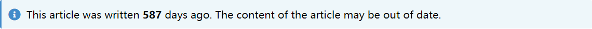

- 如果在`warning.on`上打开，则每篇文章都自带提醒
- 还可以在每篇文章的`md`文件里添加`Warning: true`来打开文章的过期提醒
- `Days`是过期的天数限制
- `Content`里面的`{}`，就是`Days`的数值，剩下的文字都可以任意修改。

### 文章页面的样式

```yml
postStyle:
  authorInfoPosition: right
  contentStyle: github
  color: "default"
```

- `authorInfoPosition`：是目录和个人简介头像的位置，有左、右两个位置

	=== "right"
		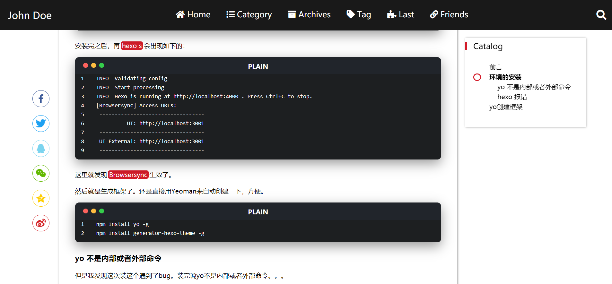

	=== "left"
		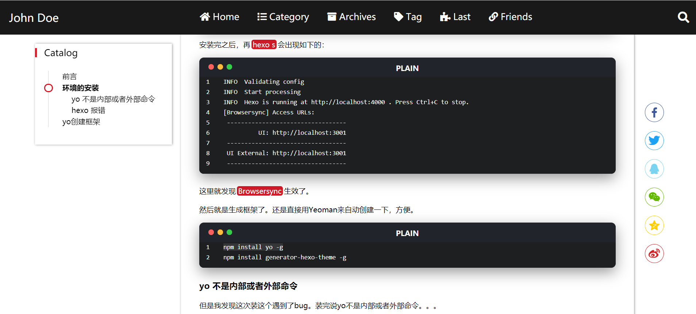

- `contentStyle`：文章页面的样式选项

	=== "github"
		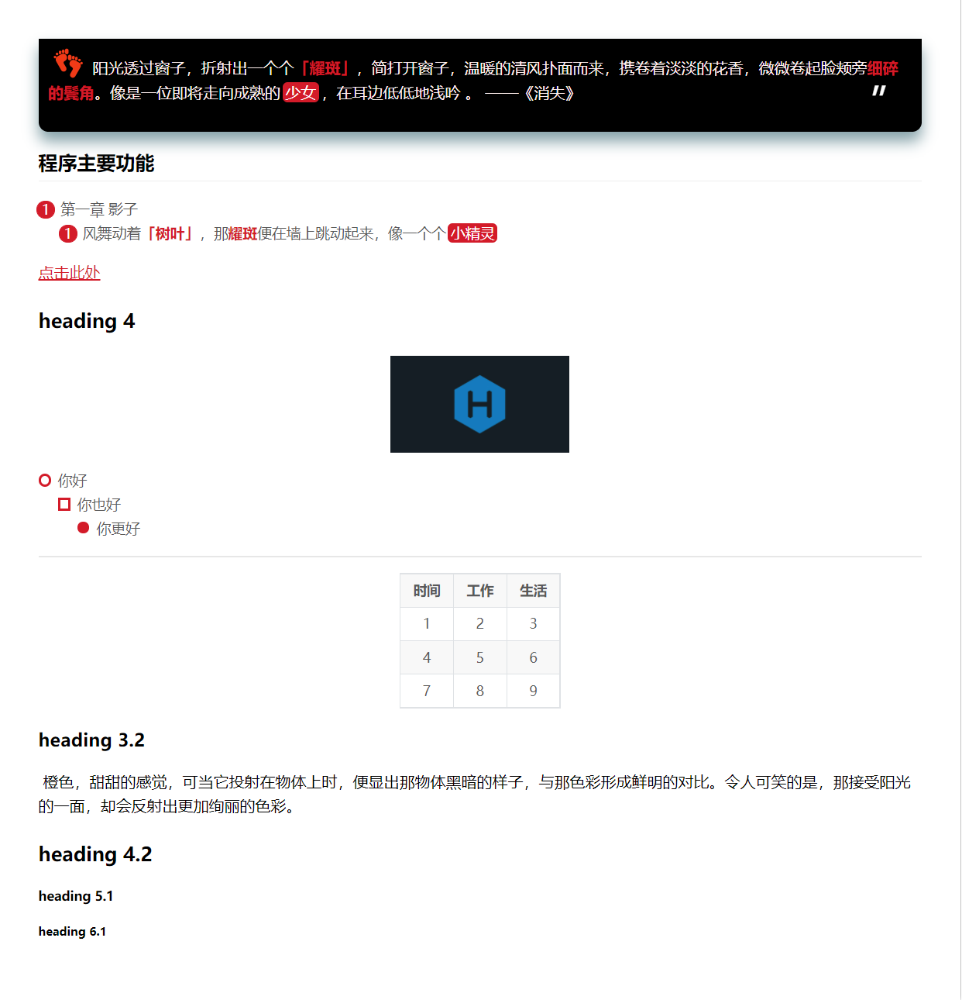
	=== "music"
		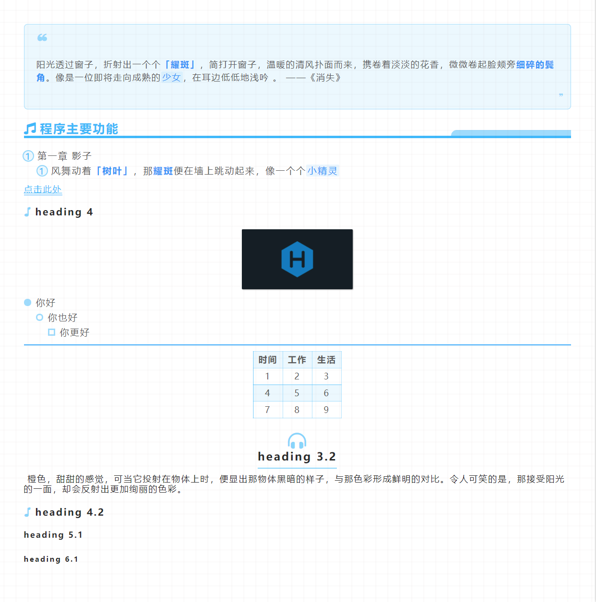
	=== "microsoft"
		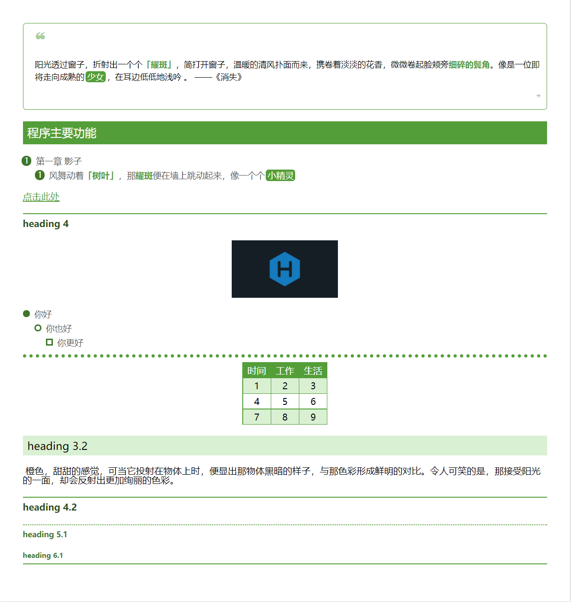

- `color`：文章页面的主题颜色

  - 默认就是`default`
  - 还可以填入颜色的名字，是在`css`里面可用的颜色名字
  - 可以填入`#XXXXXX`，以`#`开头的以十六进制的颜色

## Archive页面

```yml
archiveStyle:
  style: normal
  type: center # basic, split, center
  color: pink
```
**`style`样式**：comment-shape、normal

=== "normal"

	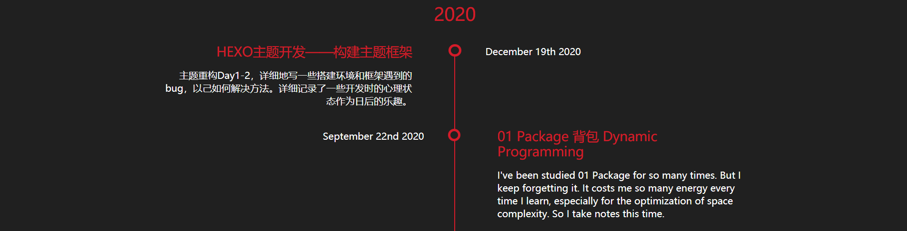
=== "comment-shape"
	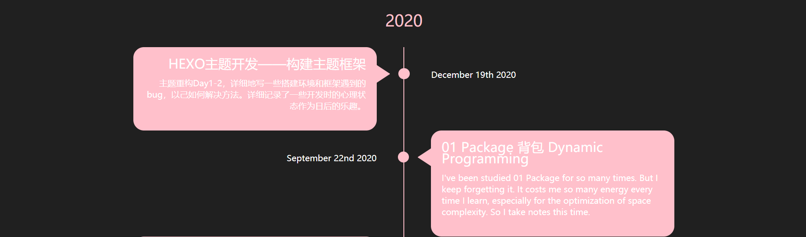

**`type`结构**：basic、split、center
=== "center"
	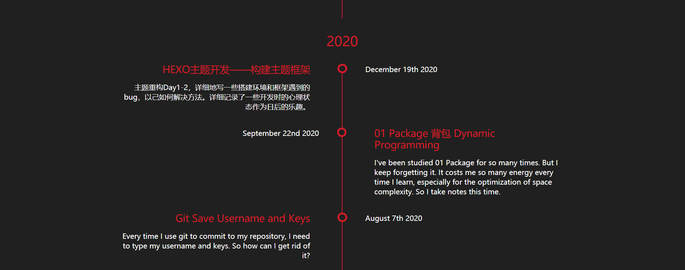
=== "split"
	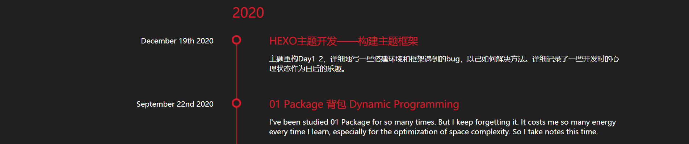
=== "basic"
	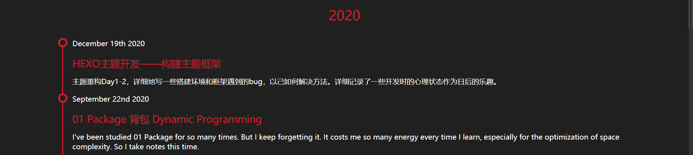

## Paginator分页

### 多文章分页

```yml
paginationNumberBackground: true
```
=== "true"
	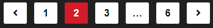
=== "false"
	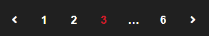

### 单文章分页

```yml
postPagePaginationStyle: card # normal  picture  card
```
=== "card"
	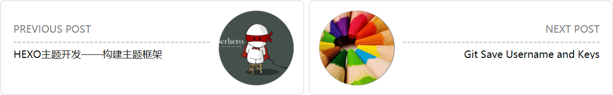
=== "picure"
	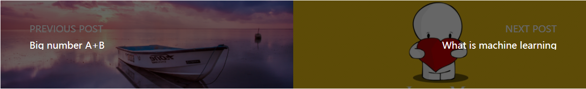
=== "normal"
	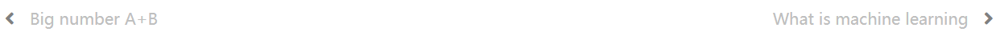