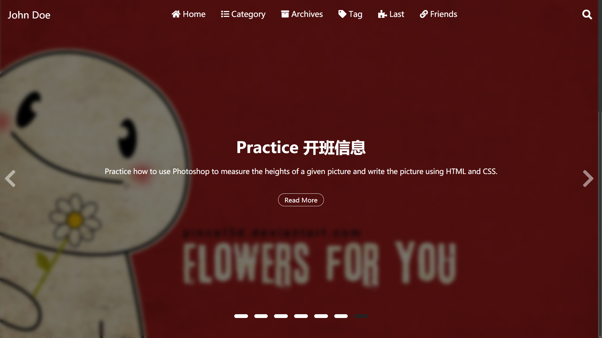

## 目录

```yml
toc:
  on: true
```

## 首页的轮播图

```yml
carousel:
  on: true
  prevNext: true
  indicators:
    on: true
    position: center # left, center, right
    style: line # dot, line
    currentColor:
      color: "#222"
      opacity: 0.9
    otherColor:
      color: "white"
      opacity: 1
  mask:
    on: true
    color: "#000"
    opacity: 0.5
  blur:
    on: true
    px: 5 
  textColor: "#fff" 
```



`preveNext`: 是否开启两侧的箭头标志

`indicators`：图片下面的指示器

- `position`：指示器的位置，有左、中、右三种

- `style`：指示器的形状，有长条，圆点两种

- `currentColor`：当前图片，指示器的颜色

- `otherColor`：没轮到的指示器的颜色

`mask`: 背景图片阴影 蒙版

- `color`：阴影的颜色，可以时任意的**十六进制**颜色表示，或者**颜色名字**
- `opacity`：透明度（0-1）之间的小数

`blur`：背景图片模糊程度，`px`数字表示模糊的程度的像素量化

`textColor`：图片上文字的颜色

## 搜搜功能(目前新版本还没实现)

```yml
# Search Function
search:
  on: true
```

## 分享功能

https://github.com/overtrue/share.js

```yml
Share:
  on: true 
  datasites: "facebook,twitter,qq,wechat,qzone,weibo" 
  wechatQrcodeTitle: "微信扫一扫：Share"
```

`datasites`是可以分享的站点，有这么多可以选择


微博、QQ空间、QQ好友、微信、腾讯微博、豆瓣、Facebook、Twitter、Linkedin、Google+、点点等社交网站。（其中Google+好像已经不能使用）

可以按照任意顺序组合

`wechatQrcodeTitle`：微信分享功能的悬浮二维码的标题

## 打赏功能

```yml
donate:
  on: true 
  wechat: true
  alipay: true
  description: Like my post? 
```

直接把二维码放在`hexo-theme-last/source/img/`下面，命名为`wechat.jpg` 和`alipay.jpg`

## 评论功能(没完成，只完成了valine)

```yml
valine:
  on: true
  appId:  # App ID
  appKey: # App Key
  verify: true # 验证码
  notify: true # 评论回复邮箱提醒
  avatar: mp # 匿名者头像选项
  placeholder: Leave your email address so you can get reply from me!
  lang: zh-cn
  guest_info: nick,mail,link
  pageSize: 10
```

具体如何使用后续会写

## 数学公式

```yml
mathjax:
  enable: true
  per_page: true
  cdn: https://cdn.jsdelivr.net/npm/mathjax/MathJax.js?config=TeX-AMS-MML_HTMLorMML
```

需要`hexo`插件`hexo-math` 和 `hexo-renderer-kramed ` 的支持

```
npm install hexo-math hexorenderer-kramed
```

cdn可以自己配置，但是一般默认的就行。

是用`kramed`渲染，语法要求比较严格，需要绝对的正确的语法才能正确渲染，比如一些空格不能省略，因为它没有`Typora`使用的`pandoc`渲染功能强大。